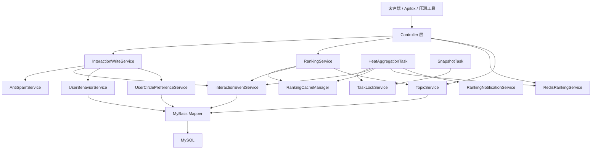

# 系统架构文档

## 项目目标

即刻 App 内容社区实时热点榜单引擎用于模拟内容社区的实时榜单核心链路：用户产生互动事件，系统通过反作弊校验、事件入库、热度聚合、缓存和推送，把话题热度变化反映到多维榜单中。

## 架构分层

## 核心链路

### 互动写入

1. `InteractionController` 校验必要参数和互动类型。
2. `InteractionWriteService` 在事务内读取话题、执行反作弊、记录行为审计、写入互动事件。
3. 频率超限会拒绝写入 `interaction_event`，但会写入无效行为记录。
4. 设备指纹风险不会直接拒绝，而是通过 `weight_multiplier` 对热度贡献降权。
5. 写入成功后更新用户圈子偏好，并清理该用户的个性化榜单缓存。

### 热度聚合

1. `HeatAggregationTask` 由定时任务触发。
2. `TaskLockService` 使用 MySQL named lock 防止多实例重复执行。
3. 聚合全量互动事件，按互动权重和 `weight_multiplier` 得到加权互动分。
4. `HeatScoreCalculator` 结合发布时间做时间衰减。
5. 批量更新 `topic.current_score` 和 `topic.interaction_count`。
6. 清理榜单缓存，同步正常话题到 Redis ZSet，并通过 `RankingNotificationService` 推送榜单变化事件。

### 榜单查询

`RankingController` 通过 `RankingCacheManager` 缓存榜单响应，缓存 key 会先归一化 `limit`，避免异常参数制造大量等价缓存项。

支持的榜单：

- 全站热榜：按 `topic.status + current_score` 排序。
- 圈子热榜：按 `circle_id + status + current_score` 排序。
- 新星榜：筛选 24 小时内发布的话题。
- 飙升榜：比较最近 1 小时和上一小时的加权互动分变化。
- 个性化热榜：先取全站候选，再按用户圈子偏好重排。

## 关键模块

| 模块 | 职责 |
| --- | --- |
| `InteractionWriteService` | 互动写入事务边界 |
| `AntiSpamService` | 频率限制、设备指纹降权、异常突增检测 |
| `HeatAggregationTask` | 定时聚合热度并触发缓存失效与通知 |
| `SnapshotTask` | 定时保存 TOP100 榜单快照 |
| `RankingService` | 多维榜单查询与个性化重排 |
| `RankingCacheManager` | 本地缓存、空值缓存、按前缀清理 |
| `RedisRankingService` | Redis ZSet 榜单同步、查询和 MySQL 排名方案对比 |
| `RankingNotificationService` | SSE 实时榜单事件推送 |
| `TaskLockService` | 多实例定时任务互斥 |

## 数据模型

核心表：

- `circle`：圈子主数据。
- `topic`：话题、热度分、互动数和状态。
- `interaction_event`：有效互动事件流水，包含反作弊热度倍率。
- `user_behavior`：用户行为审计，包含无效行为原因。
- `topic_score_snapshot`：榜单历史快照。
- `user_circle_preference`：用户圈子偏好。

详细字段与索引见 `docs/数据库设计说明.md`。

## 缓存策略

- 榜单缓存使用 JVM 本地 `ConcurrentHashMap`。
- 缓存空结果，降低穿透风险。
- TTL 带随机抖动，降低同一时间大批 key 失效。
- 屏蔽/恢复话题、热度聚合后清理榜单缓存。
- 个性化榜单按 `userId + normalizedLimit` 单独缓存。
- Redis ZSet 作为对比排名通道：热度聚合后全量替换正常话题，屏蔽话题时同步移除 Redis 成员。

## 多实例策略

定时任务通过 MySQL `GET_LOCK` / `RELEASE_LOCK` 做互斥：

- 热度聚合锁：`jike-hotrank:heat-aggregation`
- 快照任务锁：`jike-hotrank:snapshot`

锁的获取、业务执行和释放保持在同一事务连接中，避免不同实例重复聚合或重复生成快照。

## 可观测性与维护

- `repair.sql` 可用于重算互动数、热度分和用户偏好。
- `20260706_upgrade_existing_database.sql` 用于旧库补充防刷倍率字段、个性化偏好表和当前查询路径所需索引。
- `20260706_drop_legacy_redundant_indexes.sql` 用于清理早期旧 SQL 遗留的冗余索引。
- `docs/loadtest` 下保留压测入口脚本，用于后续 Day5 性能审查。
